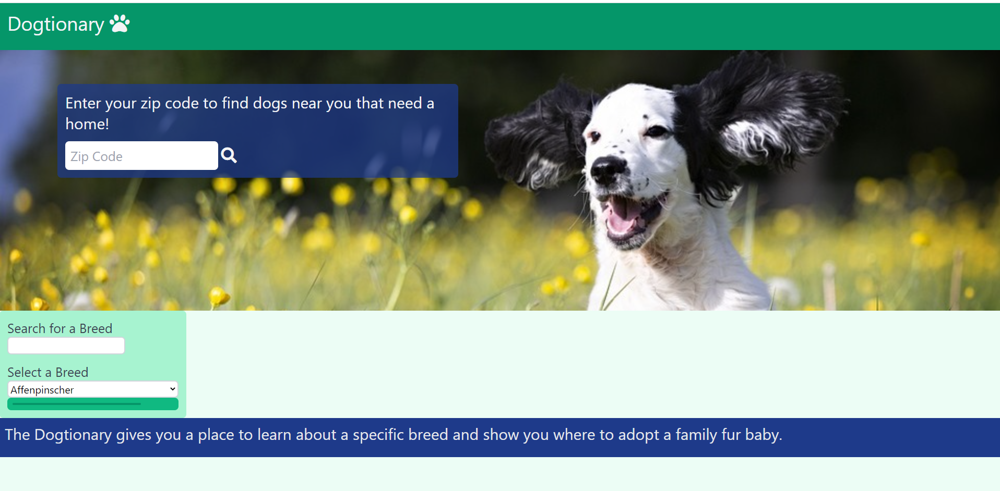
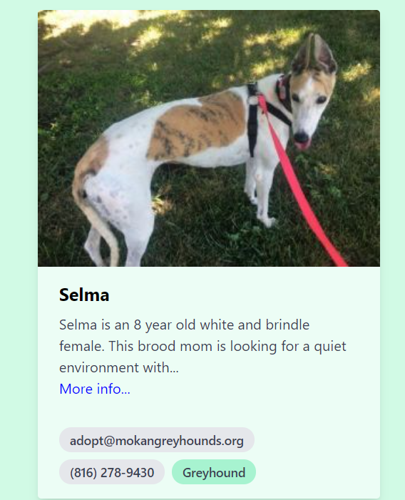
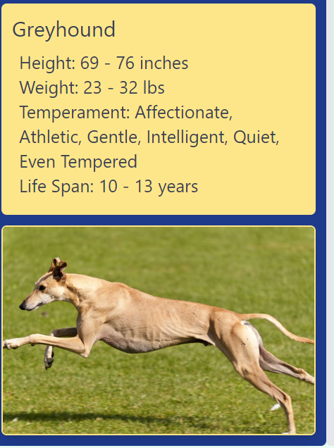
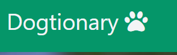

# Dogtionary
https://kcnancy.github.io/Project1Group4/

## Table of Contents
* [Description](#description)
* [User Story](#userstory)
* [Development](#development)
* [Usage](#usage)
* [Tests and Known Issues](#tests-and-known-issues)
* [Future Enhancements](#future-enhancements)
* [Credits](#credits)
* [License](#license)

## Description
Dogtionary is the first group project for our bootcamp. Dogtionary is an interactive site that assists in finding adoptable dogs.

## User Story

As a dog lover

I want to see what dogs are available for adoption near me and learn something about the breed of the dog.

When I open the Dogtionary

I want to be able to enter my zip code and see what dogs are currently available for adoption near me. 

Then I want to click on the breed of the dog that catches my eye and see more information about that breed.

## Development
To develop this project html, js, jquery, ajax and tailwindcss were used. API's were used to retrieve information from petfinder for adoption information and thedogapi for breed specific information. 
#### Resources
* https://tailwindcss.com/
* https://www.petfinder.com/developers/
* https://thedogapi.com/

## Usage
Opening page when https://kcnancy.github.io/Project1Group4/ is launched.

Upon entering a zip code and clicking enter the zip code will be validated with the Petfinder API and a list of up to 30 adoptable dogs will be returned. 
<!-- blank line -->
<figure class="video_container">
  <video controls="true" allowfullscreen="true" poster="images/poster_image.png">
    <source src="images/Dogtionaryadoptables.mp4" type="video/mp4">
    </video>
</figure>
<!-- blank line -->

Once the adoptable are displayed the user can scroll through the card for each dog. Each card contains an image of the dog as well as contact information for adoption. 

Within each card is a green button with the breed name. The user will click on this button to be shown the breed information. The breed name will be populated into the Search for a Breed box.

If the user clicks on the more info... link in the description of the adoptable dog, a new browser window will open to petfinder where additional information specific to that dog can be found.

Clicking on the Dogtionary logo in the header, at the top of the page will refresh and reset the page.

## Tests and Known Issues

## Future Enhancements
- Add facts and images for additional common breeds.
- Enhance user options to allow users to upload pictures of adopted pets. 
- Add the option to search for local dog parks.

## Credits
- Matthew Bishop
- Nancy McBride
- Brenna McLeod
## License
MIT License

Copyright (c) 2021 KU Boot Camp

Permission is hereby granted, free of charge, to any person obtaining a copy
of this software and associated documentation files (the "Software"), to deal
in the Software without restriction, including without limitation the rights
to use, copy, modify, merge, publish, distribute, sublicense, and/or sell
copies of the Software, and to permit persons to whom the Software is
furnished to do so, subject to the following conditions:

The above copyright notice and this permission notice shall be included in all
copies or substantial portions of the Software.

THE SOFTWARE IS PROVIDED "AS IS", WITHOUT WARRANTY OF ANY KIND, EXPRESS OR
IMPLIED, INCLUDING BUT NOT LIMITED TO THE WARRANTIES OF MERCHANTABILITY,
FITNESS FOR A PARTICULAR PURPOSE AND NONINFRINGEMENT. IN NO EVENT SHALL THE
AUTHORS OR COPYRIGHT HOLDERS BE LIABLE FOR ANY CLAIM, DAMAGES OR OTHER
LIABILITY, WHETHER IN AN ACTION OF CONTRACT, TORT OR OTHERWISE, ARISING FROM,
OUT OF OR IN CONNECTION WITH THE SOFTWARE OR THE USE OR OTHER DEALINGS IN THE
SOFTWARE.